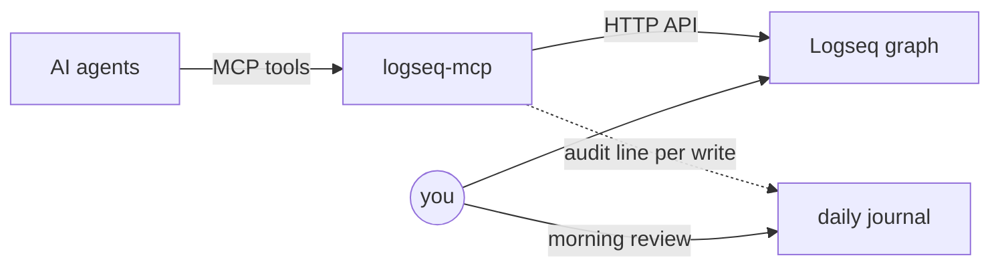

# Logseq MCP Server

**Turn your Logseq graph into memory and workspace for AI agents.** A
[Model Context Protocol](https://modelcontextprotocol.io) server for
[Logseq](https://logseq.com) with safety-scoped writes, an audit trail in your
daily journal, and verified queries exposed as tools. Built on **FastMCP** (the
high-level API of the official `mcp` package).

[](https://pypi.org/project/mcp-server-logseq/)
[](https://pypi.org/project/mcp-server-logseq/)
[](LICENSE)

<a href="https://glama.ai/mcp/servers/@dailydaniel/logseq-mcp">
  
</a>

> Targets the **file/Markdown ("OG") version** of Logseq — and plain-text files
> are part of why a graph makes good agent memory: git-syncable, greppable,
> durable, no lock-in. The newer DB (SQLite) version changed the underlying
> schema; some methods may behave differently there.

## Why

Agents need durable memory, and you already maintain one — your graph. The
missing piece is access you can trust: an agent should read broadly and write
usefully, but never touch what it shouldn't — and never do anything you can't
see. Three design choices make that possible:

- **Namespace-scoped writes.** Agents write only under their own prefix
  (`byAgent/` by default), plus one deliberately narrow cross-namespace channel
  that can change nothing but a task's `TODO/DOING/DONE` marker. Blacklisted
  pages are hidden and redacted from every read.
- **An audit trail in your daily journal.** Every successful write appends a
  line like `22:30 [[byAgent]] wrote [[byAgent/readingList/...]]` to today's
  journal — reviewing your agents' work becomes part of a morning routine you
  already have.
- **Verified queries as tools.** Ship known-good Datalog from config as named
  tools (`query_week_plan`, …), so agents don't compose datascript by hand and
  cheaper models stay reliable.

## How I use it

I run a small fleet of Claude Code agents with this server on an always-on Mac
mini, against my live personal graph:

- **Nightly research.** A link dropped into the reading list from the phone; at
  night an agent claims it (`status:: researching`), reads the article — or
  shallow-clones and reads the repo — writes a structured summary onto the page
  and flips it to `read`.
- **Morning brief.** At 08:30 a small model assembles a one-page dashboard —
  what was read overnight, week-plan progress, current NOW/DOING tasks — and
  sends a single push notification.
- **One journal for everyone.** The human's tasks and the agents' audit lines
  interleave in the same daily note:


The pages the researcher writes — properties, summary, relevance — link straight
into the rest of the graph:




## Requirements

- A running Logseq with the **local HTTP API server enabled**
  (Settings → Features → *HTTP APIs server*, then start it from the 🔌 menu).
- An **authorization token** created in the HTTP API server settings.

## Usage

### Claude Code

Local (stdio), token from the environment:

```bash
claude mcp add logseq --scope user --env LOGSEQ_API_TOKEN=<YOUR_TOKEN> -- uvx mcp-server-logseq
```

Or point it at a remote instance over Streamable HTTP (how phone and remote
sessions reach a headless host — see [Transports](#transports)):

```bash
claude mcp add logseq --scope user --transport http http://<host>:8000/mcp \
  --header "Authorization: Bearer <LOGSEQ_MCP_HTTP_TOKEN>"
```

### Claude Desktop

```json
{
  "mcpServers": {
    "logseq": {
      "command": "uvx",
      "args": ["mcp-server-logseq"],
      "env": {
        "LOGSEQ_API_TOKEN": "<YOUR_TOKEN>",
        "LOGSEQ_API_URL": "http://127.0.0.1:12315"
      }
    }
  }
}
```

## Configuration

| Source | Token | URL |
| --- | --- | --- |
| Environment | `LOGSEQ_API_TOKEN` | `LOGSEQ_API_URL` (default `http://localhost:12315`) |
| CLI flag | `--api-key` | `--url` |

The token is read from the environment or `--api-key`; it is never stored in
code. A `.env` file is supported (see `.env.example`).

### Config file (optional)

Behaviour beyond the defaults is set in a TOML file — path from
`LOGSEQ_MCP_CONFIG` (default `~/.config/logseq-mcp/config.toml`). Custom queries
live in EDN files next to it. **The server runs fine with no config file** (safe
read-mostly defaults); see [`examples/config.toml`](examples/config.toml) for a
full annotated example.

| Section | Key options |
| --- | --- |
| `[read]` | `resolve_depth` — how deep to expand `((block refs))` |
| `[write]` | `agent_write_prefix` (default `byAgent`), `allow_agents_write_any` |
| `[search]` | `files_path` — graph folder; set it to use the ripgrep backend |
| `[blacklist]` | `pages` — pages (and subpages) to hide and redact everywhere |
| `[tasks]` | `allow_status_change` — gate for `set_task_status` |
| `[audit_log]` | `enabled` — log writes to today's journal |
| `[worklog]` | `enabled`, `namespace`, `root_block`, `exclude`, `agent_namespace`, `agent_exclude` — the worklog channel |
| `[queries.<name>]` | a named query: `file`/inline `query`, `register_as_tool`, … |

Secrets and the API URL stay in the environment, never in this file.

## Transports

By default the server runs over **stdio** (for Claude Desktop and other local
clients). A **Streamable HTTP** transport is also available for remote/networked
use (e.g. a phone client):

```bash
LOGSEQ_MCP_HTTP_TOKEN=<client-secret> \
  mcp-server-logseq --transport streamable-http --host 0.0.0.0 --port 8000
# MCP endpoint: http://<host>:8000/mcp
```

Env vars: `LOGSEQ_MCP_TRANSPORT`, `LOGSEQ_MCP_HOST`, `LOGSEQ_MCP_PORT`,
`LOGSEQ_MCP_HTTP_TOKEN` (or `--http-token`).

### Authentication

The Streamable HTTP transport **requires** a bearer token: every request must
send `Authorization: Bearer <LOGSEQ_MCP_HTTP_TOKEN>`, or it gets `401`. The
server refuses to start in this mode without a token set. Note this is a
distinct secret from `LOGSEQ_API_TOKEN`:

| Secret | Direction |
| --- | --- |
| `LOGSEQ_API_TOKEN` | this server → Logseq |
| `LOGSEQ_MCP_HTTP_TOKEN` | client (phone) → this server |

> ⚠️ A bearer token over **plain HTTP** is only safe on an already-encrypted
> channel. Don't expose the raw port to the open internet. The easy path for a
> home/headless host is **Tailscale**: install it on the host and the client,
> and reach `http://<host>.<tailnet>.ts.net:8000/mcp` over the encrypted
> tunnel — no domains, nginx, or certificates. (`tailscale serve` can add TLS
> if you want `https://`.)

## Docker

Build once:

```bash
docker build -t logseq-mcp .
```

Quick try (ephemeral — `--rm` removes the container on stop):

```bash
docker run --rm -p 8000:8000 \
  -e LOGSEQ_API_TOKEN=<logseq-token> \
  -e LOGSEQ_MCP_HTTP_TOKEN=<client-secret> \
  -e TZ=Europe/Moscow \
  logseq-mcp
```

Persistent deploy (e.g. a headless Mac mini) — run once; `--restart` brings it
back after reboots:

```bash
docker run -d --name logseq-mcp --restart unless-stopped -p 8000:8000 \
  -e LOGSEQ_API_TOKEN=<logseq-token> \
  -e LOGSEQ_MCP_HTTP_TOKEN=<client-secret> \
  -e TZ=Europe/Moscow \
  -e LOGSEQ_MCP_CONFIG=/cfg/config.toml \
  -v /path/to/config-dir:/cfg:ro \
  -v "/path/to/your/graph:/graph:ro" \
  logseq-mcp
```

- `-v .../config-dir:/cfg` — folder holding your `config.toml` (+ `queries/`,
  `rules/`); set `files_path = "/graph"` in it to enable file search. Omit both
  the mount and `LOGSEQ_MCP_CONFIG` to run on defaults.
- `-v .../graph:/graph` — your Logseq graph folder (read-only), for file search.
- `-e TZ=<zone>` — local time for audit-log timestamps (image bundles `tzdata`;
  the clock is UTC otherwise).

The container serves Streamable HTTP on port 8000 and talks to a Logseq running
on the **host**. On Docker Desktop (macOS/Windows) the default
`LOGSEQ_API_URL=http://host.docker.internal:12315` already points at the host;
on Linux add `--add-host=host.docker.internal:host-gateway` (or set
`LOGSEQ_API_URL` to the host IP). Make sure Logseq's HTTP API server is running
and listening.

## Tools

All read output is normalized to a flat JSON shape and passed through the
blacklist. Reads resolve `((block refs))` non-lossily (the resolved block's
`uuid`/`status` is kept so you can act on it).

### Find
- **search** — full-text search over block content (`query`, `regex?`, `limit?`,
  `case_sensitive?`, `exclude_journals?`). Uses ripgrep over `files_path` when
  set, else a datascript content match.
- **find_tasks** — task blocks by `markers?`, `tag?`, `under_tag?` (descendant),
  `page?`, `priority?`, `limit?`.
- **list_pages** — page names under a namespace `prefix?` (`depth?` limits levels).
  Discovers a namespace's child pages, which are separate pages a parent's
  `read_page` won't show. Structure only, not block content.
- **custom_query** — run a named query from the config (`name`, `inputs?`).
- **list_custom_queries** — list the configured queries.
- **datascript_query** — run a raw Datalog query (`query`, `inputs?`, `rules?`).

### Guide
- **get_logseq_guide** — returns the authoritative guide for querying/writing this
  graph (verified Datalog gotchas: lowercase names, prefix descendants, marker and
  journal-day types, tags vs refs, read/write scoping). A single source of truth
  co-located with the server, so agents don't re-derive (and mis-derive) behaviour.

### Read
- **read_page** — a page as a normalized block tree (`page`, `depth?`).
- **read_block** — a block and its children (`uuid`, `depth?`).

### Write (agent namespace only)
- **write_note** — create/append/replace a page under `agent_write_prefix`
  (`subpath`, `content?`, `mode?`, `properties?`).
- **set_page_properties** — set/remove page properties (`subpath`, `properties`;
  a `null` value removes one).
- **edit_block** — replace one block's content (`uuid`, `old_content`,
  `new_content`). Read-before-write is enforced: the edit is rejected unless
  `old_content` matches the block's exact current content. Agent namespace only.

### Tasks
- **create_task** — create a task block in the agent namespace (`title`, `agent`,
  `project?`, `marker?`, `priority?`, `tags?`, `plan_page?`, `blocks_on?`,
  `on_page?`). The only way to create tasks — `write_note` rejects content that
  starts with a task marker.
- **set_task_status** — change only a task's marker (`uuid`, `status`); gated by
  `[tasks].allow_status_change`.

### Worklog (today's journal; `[worklog].enabled`)
An agent that does work should be able to say so where the rest of the work is
recorded — the journal — in the same shape a human keeps by hand:

```
#_worklog
  #_work/dynamo
    ((6a9eb940-758e-4966-a31d-f91e79c35f42))
      17:50 #_agents/claude/work-scout told how to update
```

- **list_work_projects** — the closed set of projects a note may be filed under
  (the direct children of `[worklog].namespace`, minus `exclude`).
- **list_agents** — the closed set of names a note may be signed with, as
  `<runtime>/<name>`: the pages exactly two levels below the agent registry
  `[worklog].agent_namespace` (default `_agents`), from any runtime — a new one
  (`_agents/codex/...`) needs no config.
- **add_journal_note** — append `HH:MM #<agent> <text>` to today's journal under a
  project (`text`, `work`, `agent`, `task?`), nested under a `((ref))` when a task
  is given.
- **get_worklog_setup_template** — the worklog section for an agent's instructions
  file (CLAUDE.md, AGENTS.md): which task to log under, when to move its status,
  what an entry looks like. Called only when the user asks to set that up — "add
  the worklog to CLAUDE.md" in any session is enough. The template is
  [`worklog_setup.md`](src/mcp_server_logseq/worklog_setup.md).

The signature sits **inline on the note**, not as a grouping level: several agents
logging against one project would otherwise split it into parallel subtrees, each
with its own chronology. Note that the server cannot authenticate the caller — every
session presents the same bearer token — so `agent` is an honesty convention
validated against a list, not an identity. It catches a typo, not a masquerade.

What the list CAN promise is that agents cannot add themselves to it. Two rules
hold that line. The registry lives **outside** the agents' write prefix, so
`write_note` cannot create a page there — the server refuses to start if it is
configured inside. And only pages that **have a file** count: writing
`[[_agents/claude/x]]` in any note makes Logseq create a reference-only page, which
would otherwise be enough to register a name. Registering an agent therefore means
creating its page, by hand, in Logseq.

Every header is reused only while it is still the **last block at its level**: the
`root_block` among the journal's top-level blocks, a project group inside the root,
a task anchor inside its group. A journal is chronological, and a header reused
wherever it stands keeps collecting later notes: a root opened in the morning would
render an evening note above the afternoon lines that preceded it, and with two
agents on two projects a note would join its project's earlier group, above the
other project's later line. Once anything else lands after a header, the next note
opens a fresh one — so the day reads in the order things happened, at the price of
repeated headers when work interleaves.

This is the only channel that writes outside `agent_write_prefix`, so it trades
path confinement for a narrow contract: **append-only**, **today's journal only**,
everything it creates lives under a `root_block`, `work` must come from the enum,
`task` must be an existing task block, and **the server stamps the time** (a caller
cannot pass one, so a resumed agent can't log a remembered clock). Text starting
with a task marker is rejected — use `create_task`.

### Dynamic
- **query_&lt;name&gt;** — each config query with `register_as_tool = true` is
  exposed as its own tool.

## Development

```bash
git clone https://github.com/dailydaniel/logseq-mcp.git
cd logseq-mcp
cp .env.example .env   # fill in LOGSEQ_API_TOKEN
uv sync
uv run mcp-server-logseq
```

Inspect with the MCP Inspector:

```bash
npx @modelcontextprotocol/inspector uv --directory . run mcp-server-logseq
```

## License

MIT
